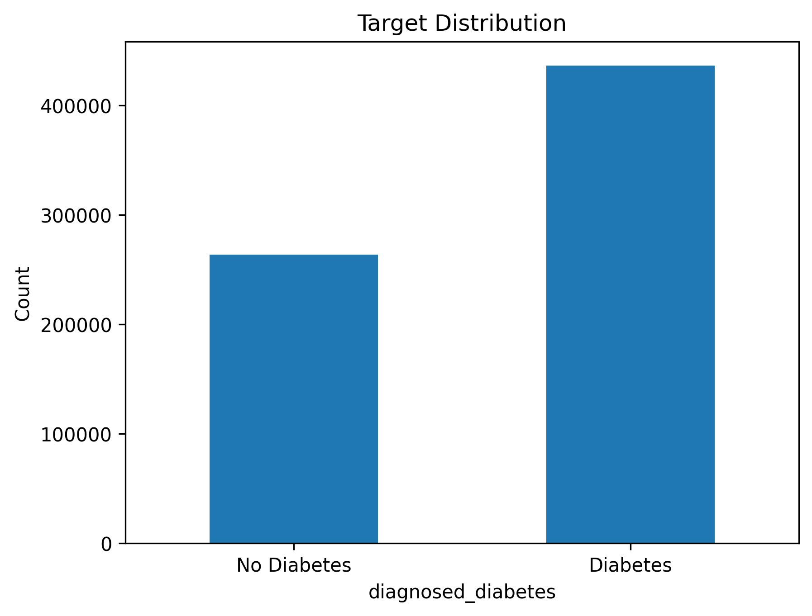
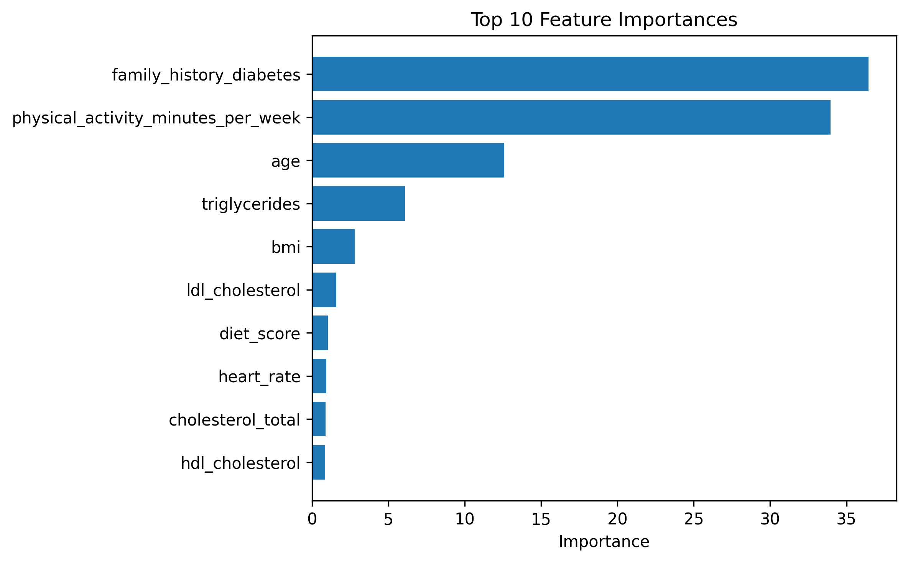

# Diabetes Risk Prediction with CatBoost

## Project Overview

This project builds a machine learning model to predict the probability of diagnosed diabetes using health, lifestyle, and demographic features.

The goal is not only to achieve a strong prediction score, but also to understand which factors contribute most to diabetes risk and how model performance changes under different feature settings.

---
## Dataset

The dataset comes from the Kaggle Playground Series S5E12 Diabetes Prediction Challenge.

Raw data files are not included in this repository.

To reproduce the project, download the dataset from Kaggle and place the files under:

data/

Expected files:

- train.csv
- test.csv
---

## Problem Type

This is a binary classification problem.

Target variable:

diagnosed_diabetes

Evaluation metric:

AUC / ROC-AUC

---

## Project Workflow

1. Data loading and initial exploration  
2. Train-validation split  
3. Baseline CatBoost model  
4. Stratified K-Fold cross-validation  
5. Feature importance analysis  
6. Ablation study  
7. Feature engineering  
8. Final model training and Kaggle submission  

---

## Modeling Approach

The main model used in this project is CatBoostClassifier.

CatBoost was selected because the dataset contains both numerical and categorical features, and CatBoost can handle categorical variables directly without requiring extensive preprocessing.

---

## Key Results

| Experiment | AUC |
|---|---:|
| Baseline CatBoost Single Split | 0.72088 |
| Stratified K-Fold CatBoost | 0.72093 |
| Ablation: Drop Top 2 Features | 0.63018 |
| Feature Engineering | 0.72046 |

---

## Key Findings

### Target Distribution

The target variable is moderately imbalanced, with diabetic cases appearing more frequently than non-diabetic cases.

### Feature Importance

Feature importance analysis showed that `family_history_diabetes` and `physical_activity_minutes_per_week` were the strongest predictors in the CatBoost model.

## Key Insights

Feature importance analysis showed that the model relied heavily on:

- family_history_diabetes  
- physical_activity_minutes_per_week  
- age  
- triglycerides  
- bmi  

The ablation study confirmed that removing the strongest predictors caused a major performance drop, suggesting that these features carry substantial predictive value.

Feature engineering did not significantly improve performance in this experiment, which suggests that CatBoost was already able to capture useful nonlinear relationships from the original features.

---

## Model comparison and final discussion

| Experiment | AUC |
|---|---:|
| Baseline CatBoost Single Split | 0.72088 |
| Stratified K-Fold CatBoost | 0.72093 |
| Ablation: Drop Top 2 Features | 0.63018 |
| Feature Engineering | 0.72046 |

The Stratified K-Fold CatBoost model achieved the most stable validation performance, with a CV AUC of approximately 0.72093.

The ablation study showed that removing `family_history_diabetes` and `physical_activity_minutes_per_week` caused a major performance drop, reducing AUC to approximately 0.630. This suggests that these two variables carry substantial predictive signal.

The engineered feature model did not improve performance over the original CatBoost model, suggesting that CatBoost was already able to capture useful nonlinear relationships from the original feature set.

---

## Limitations

- This is a Kaggle competition dataset, not real clinical deployment data.  
- Model predictions should not be interpreted as medical diagnosis.  
- Further validation would be required before any real-world healthcare use.  
- Additional explainability methods such as SHAP could improve interpretability.  

---

## Tools Used

- Python  
- pandas  
- NumPy  
- scikit-learn  
- CatBoost  
- ROC-AUC evaluation  
- Stratified K-Fold cross-validation  

---

## How to Run

1. Download the Kaggle diabetes dataset and place `train.csv` and `test.csv` inside the `data/` folder.

2. Open the notebook:

notebook/diabetes-prediction.ipynb

3. Run the notebook cells sequentially.

---

## Project Structure

diabetes-prediction-ml/

├── README.md  
├── .gitignore  
├── LICENSE  
├── data/  
│   └── .gitkeep
├── images/  
│   ├── feature_importance.png  
│   └── target_distribution.png  
├── notebook/  
│   ├── diabetes_prediction.ipynb  
│   ├── diabetes-prediction-draft2.pdf  
│   └── catboost_info/  